# 💕 Us Two

<p align="center">
  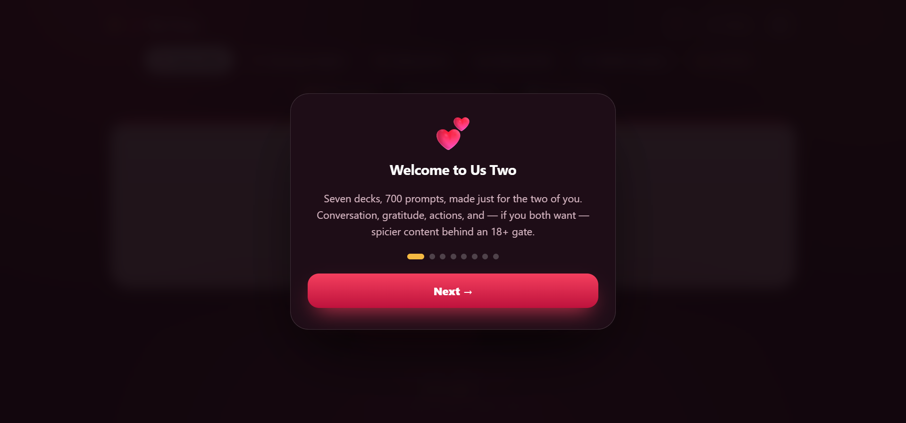
</p>

<p align="center">
  <strong>A single-file, offline-capable card game for couples.</strong><br>
  Conversation, connection, gratitude, and (behind a consent gate) adult play. Works on one device or synced across two.
</p>

<p align="center">
  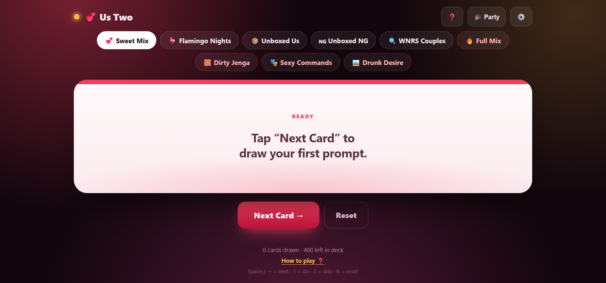
</p>

<p align="center">
  <em>Desktop layout with the game chips and an active prompt.</em>
</p>

Built as one HTML file with zero build steps, zero backend, and zero accounts. Drop it on any static host, share the link, and play.

> Looking for the party/friends version? That lives [here](https://github.com/MmedaraU/party-games) with its own README.

> 📸 **A note on images:** Every image in this README is a PNG, named `img-1.png`, `img-2.png`, `img-3.png`, and so on, in the order they appear. All files live in an `img/` folder next to `README.md`.

---

## Table of Contents

- [Features](#features)
- [Screenshots](#screenshots)
- [Quick Start](#quick-start)
- [How to Play](#how-to-play)
- [The Decks](#the-decks)
- [Adult Content & Consent](#adult-content--consent)
- [Safety & Responsible Play](#safety--responsible-play)
- [Mix Modes](#mix-modes)
- [Scoring — Never Have I Ever](#scoring--never-have-i-ever)
- [Party Mode (Double Dates)](#party-mode-double-dates)
- [Onboarding Guide](#onboarding-guide)
- [Dark Mode](#dark-mode)
- [Keyboard Shortcuts](#keyboard-shortcuts)
- [Responsive Design](#responsive-design)
- [Deployment](#deployment)
- [Customization](#customization)
- [Technical Architecture](#technical-architecture)
- [Browser Support](#browser-support)
- [Troubleshooting](#troubleshooting)
- [Known Limitations](#known-limitations)
- [Roadmap](#roadmap)
- [Image Reference](#image-reference)
- [License](#license)

---

## Features

- **800 prompts** across eight decks — four sweet decks, three adult decks (18+), and one scoring deck (18+).
- **Consent gate for adult content** — a three-checkbox agreement appears before any mature deck, remembered for 24 hours and clearable anytime. In Party Mode, each guest confirms on their own device before any adult card renders.
- **Sweet Mix and Full Mix** — one safe shuffle, one that includes everything.
- **Action cards** — some prompts ask you to do something together. Accept with **💕 LET'S DO IT** or skip with **⏭️ SKIP FOR NOW**.
- **Scoring deck** — Never Have I Ever lets both partners vote **✋ I HAVE** or **🙅 I HAVEN'T** on their own device, then reveals the tally with live score updates. If a vote is holding things up, the host can skip the card without scoring anyone.
- **Drunk Desire safety note** — a small responsible-play reminder appears on the card itself.
- **Real-time Party Mode** — for double dates: one host, everyone sees the same card. Guests dedup on rejoin via a persistent client ID, and duplicate names get auto-numbered.
- **Dark mode** — Light, Dark, and System themes, saved per device, with no flash of light content on load.
- **Hamburger deck selector on mobile** — full-width button opens a bottom sheet with the sweet and mature sections separated.
- **Onboarding guide** — a 9-step tour on first open, reopenable anytime.
- **Fully responsive** — tuned for phones, tablets, laptops, and landscape phones.
- **Zero backend** — pure client-side, deploys anywhere static files are served.
- **Offline solo play** — works without internet if you skip Party Mode.

---

## Screenshots

### Desktop and mobile

| Desktop                                         | Mobile                                                  |
| ----------------------------------------------- | ------------------------------------------------------- |
|  | 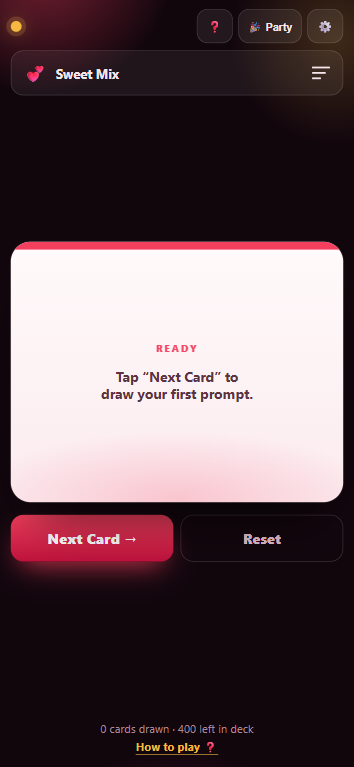 |

<p align="center">
  <em>Left: desktop chips row and full-size card. Right: mobile game selector bar with the bottom sheet closed.</em>
</p>

### Deck selector on mobile

<p align="center">
  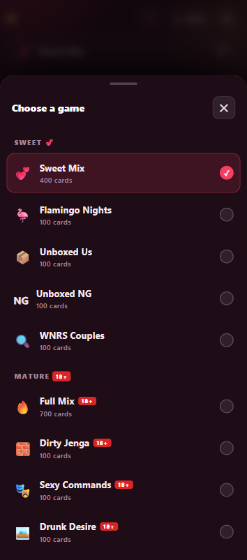
</p>

<p align="center">
  <em>The bottom sheet is split into <strong>Sweet 💕</strong> and <strong>Mature 18+</strong> sections, each showing card counts and 18+ badges where relevant.</em>
</p>

### 18+ consent gate

<p align="center">
  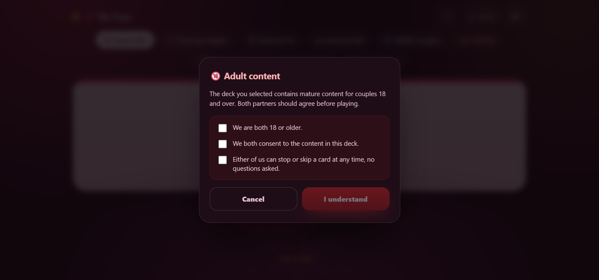
</p>

<p align="center">
  <em>Three confirmations are required before any adult deck loads. Consent is remembered for 24 hours and clearable from Settings. In Party Mode, each device confirms independently.</em>
</p>

### Action card

<p align="center">
  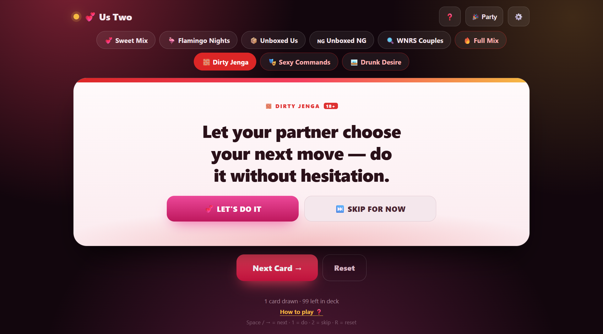
</p>

<p align="center">
  <em>Action cards from Unboxed Us, Dirty Jenga, and Sexy Commands show both buttons. Skipping is always free.</em>
</p>

### Drunk Desire safety note

<p align="center">
  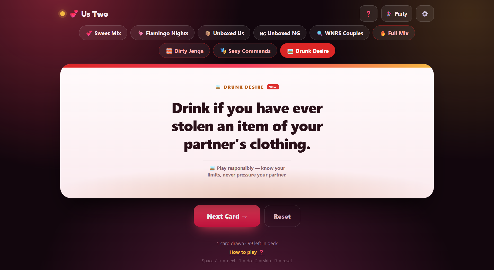
</p>

<p align="center">
  <em>The Drunk Desire deck shows a responsible-play reminder on every card: know your limits, never pressure your partner.</em>
</p>

### Never Have I Ever — scoring

<p align="center">
  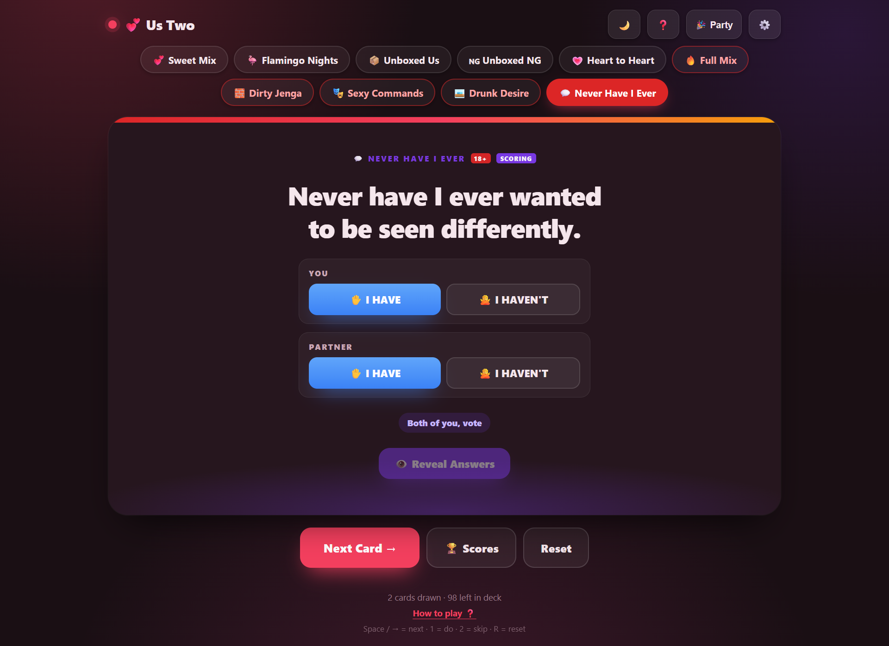
</p>

<p align="center">
  <em>Scoring cards show I HAVE and I HAVEN'T. Both partners vote on their own device in Party Mode, or on the same screen in solo.</em>
</p>

### Party Mode host panel

<p align="center">
  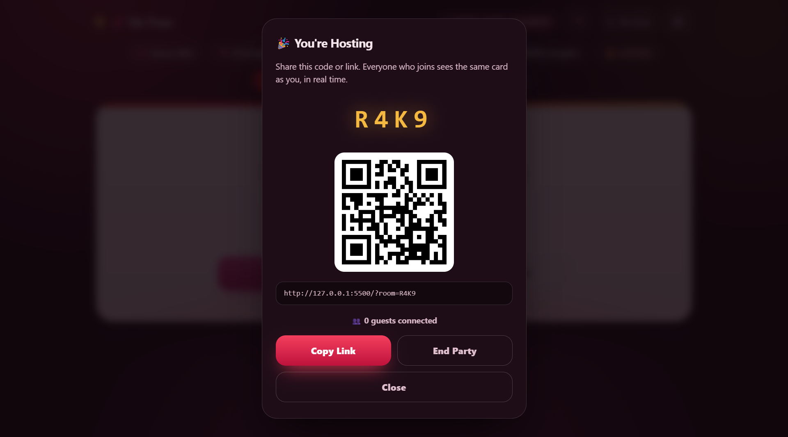
</p>

<p align="center">
  <em>Share the code, link, or QR for a double-date session. Everyone sees the same card in real time.</em>
</p>

### Light and Dark mode

<p align="center">
  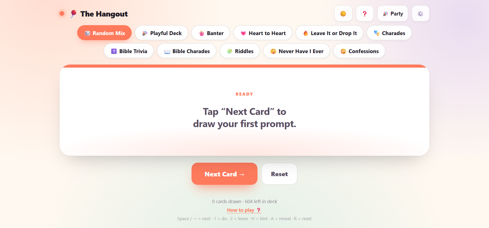
</p>

<p align="center">
  <em>Tap the theme button in the header to cycle Light, Dark, and System. The preference is saved per device.</em>
</p>

---

## Quick Start

### Run locally

1. Download `us-two.html` (or copy the code into a file with that name).
2. Double-click it to open in any modern browser.
3. Tap **Next Card** to draw.

Solo mode works fully offline over `file://`.

### Long-distance or two devices

1. Open the file on one device and tap **🎉 Party → Host a Party**.
2. Share the 4-character code, link, or QR code with your partner.
3. They open the link or join by typing the code.
4. Draw cards — both screens stay in sync.

> Party Mode needs internet access for the initial peer connection. Solo mode does not.

---

## How to Play

### On one device

1. Pick a deck using the chips at the top (desktop) or the game selector bar (mobile).
2. Tap **Next Card**, swipe left on the card, or press **Space / →**.
3. Read the prompt aloud. Take turns, or answer together.
4. For action cards, tap **💕 LET'S DO IT** or **⏭️ SKIP FOR NOW**.
5. For Never Have I Ever, tap **✋ I HAVE** or **🙅 I HAVEN'T** for each of you — the reveal fires when both votes are in.
6. Tap **Reset** (or press **R**) to reshuffle and start over. Reset also clears scores.

### Across two devices

- One partner **hosts** and controls the deck: draws cards, switches modes, resets.
- The other partner **joins** and sees the same card in real time.
- Guests can tap **Let's Do It**, **Skip**, or **vote** — the host's device receives the choice and advances both.
- The host's device must stay open and online. Closing or refreshing it ends the room, and the site warns before you navigate away.

---

## The Decks

<p align="center">
  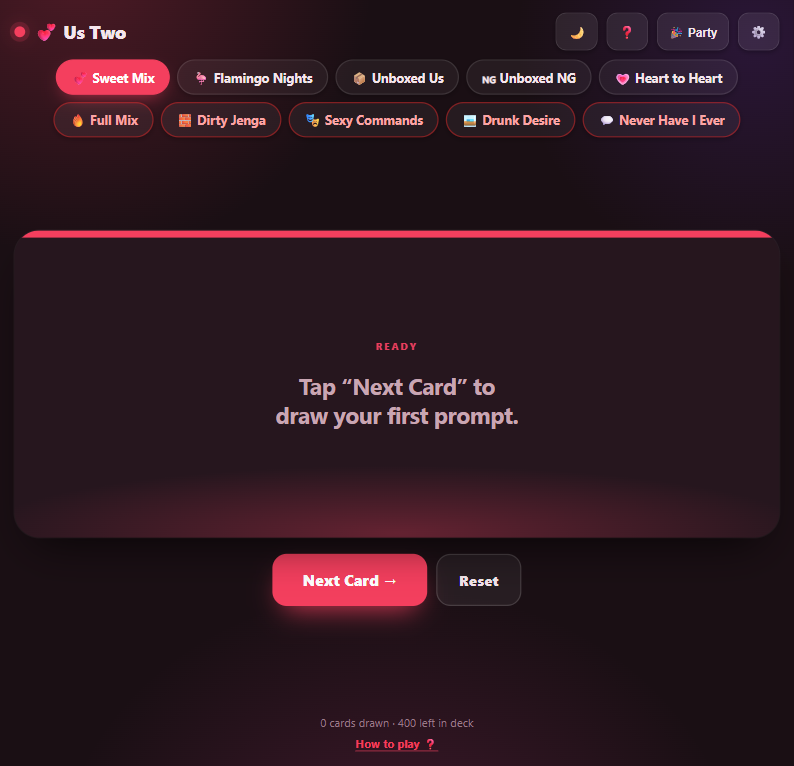
</p>

| Deck              | Emoji | Count   | Style                                                      | Adult   | In Sweet Mix |
| ----------------- | ----- | ------- | ---------------------------------------------------------- | ------- | ------------ |
| Flamingo Nights   | 🦩     | 100     | Deep conversation + playful dilemmas                       | No      | ✅            |
| Unboxed Us        | 📦     | 100     | Conversation + actionable dares                            | No      | ✅            |
| Unboxed NG        | 🇳🇬     | 100     | Nigerian couple conversation                               | No      | ✅            |
| Heart to Heart    | 💗     | 100     | Tiered deep questions — Perception, Connection, Reflection | No      | ✅            |
| Dirty Jenga       | 🧱     | 100     | Jenga-block style dares and questions                      | **18+** | ❌            |
| Sexy Commands     | 🎭     | 100     | Simon-Says style intimate commands                         | **18+** | ❌            |
| Drunk Desire      | 🥃     | 100     | Drinking-game prompts                                      | **18+** | ❌            |
| Never Have I Ever | 💬     | 100     | Couple confessions with finger scoring                     | **18+** | ❌            |
| **Sweet Mix**     | 💕     | **400** | The four sweet decks shuffled together                     | No      | —            |
| **Full Mix**      | 🔥     | **800** | Every deck shuffled together                               | **18+** | —            |

> Internally the Heart to Heart deck uses the key `wnrs`, since its tiered format was inspired by that style. The prompts are original.

### Card behaviour by type

| Type                 | Deck(s)                                                         | Buttons shown                                    |
| -------------------- | --------------------------------------------------------------- | ------------------------------------------------ |
| Plain                | Flamingo Nights, Unboxed NG, Heart to Heart, most of Unboxed Us | None                                             |
| Action               | Unboxed Us (partly), Dirty Jenga, Sexy Commands                 | 💕 LET'S DO IT · ⏭️ SKIP FOR NOW                   |
| Action + safety note | Drunk Desire                                                    | 💕 LET'S DO IT · ⏭️ SKIP FOR NOW · safety reminder |
| Scoring              | Never Have I Ever                                               | ✋ I HAVE · 🙅 I HAVEN'T                           |

---

## Adult Content & Consent

<p align="center">
  
</p>

The four 18+ decks are gated. Selecting any of them — or **Full Mix** — triggers a consent modal before anything loads.

### The gate

The modal shows three checkboxes, and the **I understand** button stays disabled until all three are ticked:

1. I am 18 or older.
2. I consent to the content in this deck.
3. I can stop or skip a card at any time, no questions asked.

### What happens after consent

- Consent is remembered for **24 hours** in `localStorage`.
- After that, the gate reappears the next time an adult deck is selected.
- You can clear consent early from **⚙️ Settings → 🔞 Reset 18+ consent**.
- If you clear consent while an adult deck is active, the app automatically drops back to Sweet Mix.

### Visual indicators

- Adult chips have a red border tint.
- Adult cards show a red **18+** badge in the tag.
- Adult cards have a gradient red-rose-gold accent stripe.
- The deck sheet is split into **Sweet 💕** and **Mature 18+** sections.
- Sweet Mix **never** includes adult content.

### Per-device consent in Party Mode

The gate is per device. If the host switches to an adult deck, each connected guest confirms on their own device before the card renders. If a guest declines or dismisses, their screen pauses on a waiting message until they confirm — the room isn't blocked, but the guest doesn't see content they haven't agreed to.

---

## Safety & Responsible Play

<p align="center">
  
</p>

A few things worth stating plainly, since these decks deal with intimacy and alcohol.

### Consent is continuous

- Ticking the gate is the start of consent, not the end.
- Either partner can stop, pause, or skip at any time — during a card, between cards, or mid-round.
- A safe word (or a simple "not now") always wins over any card. The app has no enforcement; the two of you do.

### Skip is always free

- **⏭️ SKIP FOR NOW** exists on every action card.
- Skipping has no penalty, no counter, no record. It just moves on.

### Drunk Desire

- This deck is a drinking game. **Know your limits.**
- Hydrate. Eat something. Alternate drinks with water.
- Never pressure your partner to drink, and never let a card override their no.
- If either of you is feeling unwell, stop. The deck will wait.
- The safety reminder appears on the card itself whenever Drunk Desire is active.

### Privacy

- Everything runs in the browser. No analytics, no tracking, no server.
- Prompts are not stored anywhere except on your device in the active session.
- Party Mode is peer-to-peer; the only data leaving a device is the current card, counters, and votes.

---

## Mix Modes

Two shuffle options sit at the top of the chip list and at the top of the deck sheet.

<p align="center">
  
</p>

### 💕 Sweet Mix

Draws from the four sweet decks: Flamingo Nights, Unboxed Us, Unboxed NG, and Heart to Heart. **400 prompts total.** Safe for any mood, any time, any place.

### 🔥 Full Mix

Draws from all eight decks. **800 prompts total.** Triggers the 18+ consent gate the first time it's selected in a 24-hour window.

```js
const SWEET_MIX_DECKS = ["flamingo", "unboxed", "unboxedNg", "wnrs"];
const FULL_MIX_DECKS  = ["flamingo", "unboxed", "unboxedNg", "wnrs", "jenga", "commands", "desire", "nhie"];
```

To change what goes into either mix, edit those two arrays.

---

## Scoring — Never Have I Ever

Never Have I Ever uses a different mechanic from the rest of the site.

### How it works

1. Both partners start with **5 points**.
2. A prompt appears. Each taps **✋ I HAVE** or **🙅 I HAVEN'T**.
3. When both have voted, **👁️ Reveal Answers** enables.
4. The reveal shows who said what, and scores update: **each I HAVE drops a point.**
5. The next card draws automatically when you tap it.

### On one device

The card shows two vote rows — one for **You**, one for **Partner**. Vote on each row, then tap Reveal.

### In Party Mode

Each partner votes on their own device. The host's screen shows a live tally ("2 of 2 voted"), then reveals when everyone is in. Guests see the same breakdown and their own score.

### Reset, skip, and deck switching

- **Reset** clears the current card and puts everyone back to **5 points**.
- **Skip this card** discards the current prompt without scoring anyone. It appears only on the host's device (or solo), and only while votes are still coming in. Useful when someone has stepped away or the card isn't landing.
- **Switching to a different deck** also resets scores, so every scoring session starts fresh.
- If the host tries to switch away from the scoring deck with votes in progress, a confirmation modal appears to avoid accidental data loss.

### Leaderboard

Tap **🏆 Scores** to see everyone ranked, with a **Reset Scores** option. Guests can check their own score after the host reveals.

---

## Party Mode (Double Dates)

<p align="center">
  
</p>

Party Mode uses WebRTC (via PeerJS) so two devices — or two couples on four devices — share the same card.

### Hosting

- Tap **🎉 Party → Host a Party**.
- A 4-character room code is generated (e.g. `M4TX`).
- The host panel shows the room code, a QR code, a copyable link (`?room=M4TX`), and a live guest count.
- Actions the host takes are broadcast to every connected guest.
- If the host tries to close or refresh with active guests, the browser warns first.

### Joining

- Open the shared link (auto-joins), or
- Tap **🎉 Party → Join a Party**, enter a 4-character code and your name.

### Guest reconnection

Each guest has a persistent client ID saved in `localStorage`. If they refresh, the host recognises them and replaces their old session rather than adding a duplicate. Duplicate names are numbered automatically ("Ada 2") so the leaderboard stays unambiguous.

### What syncs

- Current card
- Deck tag and accent colour
- Drawn / done / skipped counters
- Remaining cards in the deck
- Selected mode (Sweet Mix, Full Mix, or a single deck)
- Scoring votes and leaderboard

### What does *not* sync

- The 18+ consent gate is **per device**. Each device must confirm independently.
- Sound effects and confetti are local to each device.
- Theme preference is per device.

### Guests and adult decks

- If the host selects an adult deck, each guest's device checks their consent first.
- Guests who have already consented see the card immediately.
- Guests who haven't consented see the gate before the card renders. They can confirm or dismiss. Dismissing pauses their screen on a waiting message.

---

## Onboarding Guide

<p align="center">
  
</p>

A 9-step guide appears automatically on first open and can be reopened anytime.

1. **Welcome** — what the app is and what's inside
2. **Choose your deck** — chips on desktop, hamburger selector on mobile
3. **Draw a card** — button, swipe, keyboard
4. **Action cards** — Let's Do It vs Skip
5. **Never Have I Ever** — how scoring works
6. **Adult decks** — how the 18+ gate works
7. **Drunk Desire** — responsible play reminder
8. **Party Mode** — for double dates
9. **Theme and settings** — Light/Dark/System, sound, reset, consent clearing

Reopen with the **❓** button in the header or the **How to play ❓** link in the footer.

**Keyboard navigation while the guide is open:**

- **→ / Enter** = next slide
- **←** = back
- **Esc** = close

---

## Dark Mode

Us Two ships with three theme states, cycled by the theme button in the header:

| Icon | State  | Behaviour                                       |
| ---- | ------ | ----------------------------------------------- |
| ☀️    | Light  | Warm off-white background, ink text             |
| 🌙    | Dark   | Deep plum background, soft light text           |
| 🌗    | System | Follows `prefers-color-scheme` and updates live |

### How it works

- The preference saves to `localStorage` under `usTwo.theme`.
- On first visit it defaults to **System**.
- A tiny inline script runs in `<head>` before any CSS renders, so **there's no flash of light content** when a dark-mode user loads the page.
- When set to System, the site reacts to the OS theme changing in real time.

### What stays consistent

- Deck accent colours (rose, plum, coral, gold) are unchanged across themes — they're the deck's identity and read fine on both backgrounds.
- The QR code panel stays light in dark mode, because QR scanners need high contrast.
- Sound, confetti, and Party Mode sync are unaffected.

**Theme is not synced across Party Mode.** Each device picks its own. Some people prefer dark, some light, and no one should be forced into the other's preference.

---

## Keyboard Shortcuts

| Key                     | Action                      |
| ----------------------- | --------------------------- |
| `Space` / `→` / `Enter` | Draw next card              |
| `1`                     | Let's Do It (action cards)  |
| `2`                     | Skip For Now (action cards) |
| `S`                     | Skip this card (scoring)    |
| `R`                     | Reset the deck              |

Shortcuts are paused while the onboarding guide is open, while the deck sheet is open, or while typing in an input field.

---

## Responsive Design

<p align="center">
  
</p>

### Desktop and large tablets

- Chips row at the top with all ten options (two mixes + eight decks).
- Adult chips have a red border tint.
- Full-size card, both footer shortcut hints visible.

### Phones and portrait tablets (≤1024px portrait)

- Chips hidden, replaced by a full-width game selector bar with a staggered hamburger icon.
- Tapping the bar opens a bottom sheet split into **Sweet 💕** and **Mature 18+** sections.
- Each option shows its emoji, name, card count, and an 18+ badge where relevant.
- Guests in Party Mode cannot open the sheet.

### Small phones (≤560px)

- Brand text hides, icon buttons shrink.
- Action buttons stack full-width.
- Vote rows collapse into vertical button stacks.
- Next and Reset split 50/50.
- Modals collapse to single-column actions.

### Other touches

| Feature          | Behaviour                                          |
| ---------------- | -------------------------------------------------- |
| Notched devices  | Header and footer respect `env(safe-area-inset-*)` |
| Touch devices    | Keyboard hints hidden; tap delay removed           |
| iOS text scaling | Prevented with `text-size-adjust: 100%`            |
| iOS focus zoom   | Inputs stay at 16px                                |
| Reduced motion   | All animations and transitions disabled            |

---

## Deployment

Everything lives in a single HTML file. Host it anywhere static. **HTTPS is required for Party Mode** (WebRTC).

### GitHub Pages

```bash
git add us-two.html
git commit -m "Add Us Two"
git push origin main
```

Then enable GitHub Pages in **Settings → Pages**.

### Netlify

Drag the folder onto [app.netlify.com/drop](https://app.netlify.com/drop), or connect your repo.

### Vercel

```bash
vercel --prod
```

### Cloudflare Pages

Create a project, point it at your repo, set the output directory.

### Any shared hosting

Upload `us-two.html` to `public_html` or your web root and confirm HTTPS.

### Running locally for testing

```bash
python3 -m http.server 8080
# or
npx serve .
```

Then visit `http://localhost:8080`.

---

## Customization

All editable content lives near the top of the `<script>` tag.

### Add or change prompts

Find the `RAW` object. Sweet decks are arrays of strings. Action decks use objects with `kind: "action"`. Scoring decks use plain strings too.

```js
const RAW = {
  flamingo: [
    "What about me is hardest for you to understand?",
    // ...
  ],
  unboxed: [
    { text: "Look into each other's eyes without speaking for 30 seconds.", kind: "action" },
    // ...
  ]
};
```

- Plain string = question card, no buttons.
- Object with `kind: "action"` = action card with **Let's Do It / Skip** buttons.

### Rename a deck or change its colour

```js
const DECKS = {
  flamingo: { label: "Flamingo Nights", emoji: "🦩", color: "#EC4899", adult: false },
  jenga:    { label: "Dirty Jenga",     emoji: "🧱", color: "#DC2626", adult: true  },
  nhie:     { label: "Never Have I Ever", emoji: "💬", color: "#7C3AED", adult: true, scoring: true, startScore: 5 },
  // ...
};
```

Set `adult: true` to gate the deck behind the consent modal. Set `scoring: true` and `startScore` for scoring decks.

### Mark a deck as a drinking game

```js
desire: { label: "Drunk Desire", emoji: "🥃", color: "#B45309", adult: true, drunk: true }
```

`drunk: true` displays the safety note on every card from that deck.

### Change what goes into Sweet Mix or Full Mix

```js
const SWEET_MIX_DECKS = ["flamingo", "unboxed", "unboxedNg", "wnrs"];
const FULL_MIX_DECKS  = ["flamingo", "unboxed", "unboxedNg", "wnrs", "jenga", "commands", "desire", "nhie"];
```

### Change the consent duration

```js
const CONSENT_TTL_MS = 1000 * 60 * 60 * 24; // 24 hours
```

Change to `1000 * 60 * 60 * 1` for one hour, or `1000 * 60 * 5` for five minutes.

### Change the room code length

In `makeCode()`, change the loop count from `4`, and update `maxlength="4"` in `showJoinPanel()` to match.

### Change the default theme

In the inline script inside `<head>`:

```js
var t = localStorage.getItem("usTwo.theme") || "auto";
```

Change `"auto"` to `"light"` or `"dark"` if you want a fixed default for new visitors.

### Customizing dark mode colours

Every dark-mode override lives in the `[data-theme="dark"]` block near the end of the `<style>` tag.

### Bundling dependencies locally (optional)

By default the page loads **PeerJS** from `unpkg.com` and **QR codes** from `api.qrserver.com`. To make it fully self-contained, download `peerjs.min.js` locally and swap the QR image for a client-side generator.

---

## Technical Architecture

### Stack

- **HTML + CSS + vanilla JavaScript** — no framework, no bundler, no build step.
- **PeerJS** — WebRTC wrapper for peer discovery and data channels.
- **Canvas 2D** — heart-toned confetti animation.
- **Web Audio API** — synthesized sounds (no audio files).
- **LocalStorage** — sound preference, onboarding state, consent timestamp, theme, and guest client ID.
- **QR Server API** — QR code image for the host panel.

### File structure

```
your-project/
├── us-two.html               ← everything (markup, styles, logic, decks)
├── README.md                 ← this file
└── img/
    ├── img-1.png
    ├── img-2.png
    ├── ... (see Image Reference)
    └── img-13.png
```

### State model

The host owns:

- `state.queue` — shuffled pool of remaining cards
- `state.current` — the visible card
- `state.drawn`, `state.doCount`, `state.skipCount` — counters
- `state.filter` — selected mode or deck
- `state.voters` — array of local voter objects (solo + host)
- `state.guests` — array of guest objects with votes and scores
- `state.votePhase` — `"voting"` or `"revealed"`
- `state.isScoring` — whether the current deck uses scoring
- `state.actionLocked` — brief lockout after Do/Skip to prevent double-draws

Guests mirror this via `applyRemoteState()`.

### Consent state

- `adultConsentGiven` — in-memory flag for the session
- `usTwo.adultConsent` — localStorage entry with an `expires` timestamp

### Sync messages

**Host → guests** (`buildStatePayload`):

```js
{
  type: "state",
  card, drawn, doCount, skipCount,
  remaining, filter,
  votePhase, voters, guests
}
```

**Guest → host**:

```js
{ type: "join", name: "Ada", clientId: "c1a2b3" }
{ type: "action", action: "next" | "do" | "skip" | "vote", value?: "have" | "havent" }
```

### Persistence keys

| Key                  | What                                       |
| -------------------- | ------------------------------------------ |
| `usTwo.v1`           | Sound preference                           |
| `usTwo.introSeen`    | Whether onboarding has been completed      |
| `usTwo.adultConsent` | Consent timestamp (expires after 24h)      |
| `usTwo.theme`        | `"light"`, `"dark"`, or `"auto"`           |
| `usTwo.clientId`     | Persistent guest identity for rejoin dedup |

Rooms are ephemeral. There is no server-side state.

---

## Browser Support

| Browser                           | Solo | Party Mode | 18+ Gate | Dark Mode |
| --------------------------------- | ---- | ---------- | -------- | --------- |
| Chrome / Edge (desktop + Android) | ✅    | ✅          | ✅        | ✅         |
| Safari (macOS + iOS)              | ✅    | ✅          | ✅        | ✅         |
| Firefox                           | ✅    | ✅          | ✅        | ✅         |
| Samsung Internet                  | ✅    | ✅          | ✅        | ✅         |
| Older browsers without WebRTC     | ✅    | ❌          | ✅        | ✅         |

Party Mode requires HTTPS (or `localhost`).

---

## Troubleshooting

**Adult deck asks for consent every time**

- Consent expires after 24 hours by design. If you'd rather it not expire, increase `CONSENT_TTL_MS`.
- In private browsing, localStorage may be cleared when the tab closes — the gate will reappear each session.

**Consent gate won't accept**

- All three checkboxes must be ticked. The **I understand** button stays disabled until they are.

**Dropped back to Sweet Mix unexpectedly**

- If you cleared consent from Settings while on an adult deck, the app returns to Sweet Mix. Reselect the deck and re-confirm.

**Guests can't connect**

- Confirm both devices are online and the host hasn't refreshed.
- Check the site is served over HTTPS.
- Some corporate or public Wi-Fi blocks WebRTC — try a hotspot.

**Room code not found**

- Codes are case-insensitive, use `A–Z` (minus I/O) and `2–9` (minus 0/1). Ask the host to re-read it.

**Sound doesn't play**

- Browsers block audio until the first user interaction. Tap once, then draw.
- Check the Sound toggle in ⚙️ Settings.

**Action buttons don't appear**

- Only cards from Unboxed Us, Dirty Jenga, and Sexy Commands have buttons. All other decks are plain prompts or scoring cards.

**Never Have I Ever reveal won't enable**

- Every voter must vote first. In Party Mode, watch the "X of Y voted" counter. If a partner walks away without voting, use Reset to clear the card.

**Scores disappeared**

- Reset clears scores, and so does switching decks. If you want to keep playing the same session, avoid hitting Reset or switching decks.

**The hamburger selector doesn't show on mobile**

- It appears at ≤1024px **and** in portrait orientation. Rotate to portrait.

**Dark mode flashes light on load**

- LocalStorage may be disabled, in which case the fallback is light.
- Verify the inline `<head>` script is present and runs before the `<style>` tag.

**Dark mode doesn't follow the system**

- The theme button cycles Light → Dark → System. If it's stuck on Light or Dark, the OS theme won't affect the page.

**Party Mode advanced:**

- Host device must stay awake. Screen-lock may suspend the connection on some phones.
- Guests who refresh will attempt to rejoin automatically and replace their old session.
- Closing or refreshing the host page ends the room, with a confirmation prompt if guests are still connected.

---

## Known Limitations

- **Host-dependent Party Mode** — closing the host tab ends the room.
- **No persistence** — refreshing the host starts a new room.
- **No authentication** — 4-character codes are guessable. Fine for a private double date, not for public events.
- **Consent is honour-based** — the gate is a good-faith check, not enforcement.
- **Public PeerJS cloud** — subject to rate limits and occasional downtime.
- **Sound and confetti are local** — each device reacts on its own.
- **Theme is not synced** — each device picks its own Light/Dark/System.
- **Scores are session-only** — nothing is written to `localStorage`, so a host refresh starts everyone back at 5.

---

## Roadmap

- **Custom deck builder** — add your own prompts from the UI.
- **Per-deck consent** — remember consent separately for each adult deck.
- **Date-night timer** — a soft countdown per card.
- **Mood presets** — "cozy," "playful," "deep," "spicy" as shortcuts to specific decks.
- **Shared journal** — save favourite prompts locally.
- **Localization** — Yoruba, Igbo, Hausa, Pidgin UI strings.
- **Self-hosted PeerJS + TURN** for reliability behind strict NATs.
- **PWA install** — offline caching and home-screen launch.
- **Custom theme colours** — let users pick their own accent palette.

---

## Image Reference

Every image is a PNG. Filenames follow the order they appear in this README. All files live in an `img/` folder next to `README.md`.

| Filename     | Where it appears           | What it should show                          | Suggested size |
| ------------ | -------------------------- | -------------------------------------------- | -------------- |
| `img-1.png`  | Hero banner, top of README | Us Two title card or a hero shot             | 1600×600       |
| `img-2.png`  | Screenshots — Desktop      | Desktop layout with chips and a card in view | 1200×800       |
| `img-3.png`  | Screenshots — Mobile       | Mobile view with the game selector bar       | 600×1000       |
| `img-4.png`  | Screenshots — Deck sheet   | Bottom sheet open, Sweet and Mature sections | 600×1000       |
| `img-5.png`  | Screenshots — Consent      | Three-checkbox consent modal                 | 800×900        |
| `img-6.png`  | Screenshots — Action card  | Action card with Let's Do It / Skip          | 1000×700       |
| `img-7.png`  | Screenshots — Safety note  | Drunk Desire card with reminder              | 1000×700       |
| `img-8.png`  | Party Mode host panel      | Room code, QR, link, guest count             | 800×900        |
| `img-9.png`  | Screenshots — Scoring      | Never Have I Ever card with vote buttons     | 1000×700       |
| `img-10.png` | Screenshots — Dark mode    | The full layout rendered in dark mode        | 1200×800       |
| `img-11.png` | The Decks / Mix Modes      | Close-up of the desktop chips row            | 1400×300       |
| `img-12.png` | Onboarding                 | Onboarding slide 1                           | 900×1200       |
| `img-13.png` | Responsive Design          | Same card on phone, tablet, desktop          | 1600×800       |

Until you add them, GitHub will show broken image icons — but the README reads fine without them. If you'd rather not have visible broken links during development, comment out the image blocks with `<!-- -->` and uncomment them once the files are in place.

---

## License

Free to use, modify, and share for personal use between consenting adults.

All prompt content is original and written for this project. If you redistribute, a credit link back is appreciated but not required.

The 18+ decks are intended for consensual adult play only. Neither the app nor its authors are responsible for how the prompts are used. **Play responsibly.**

---

## Credits

- Game concept and content: written for Us Two.
- Sync layer: [PeerJS](https://peerjs.com/) over WebRTC.
- QR generation: [qrserver.com](https://goqr.me/api/).
- Sound effects: synthesized in-browser with the Web Audio API.
- Confetti: custom canvas animation.

<p align="center">
  Enjoy each other. 💕
</p>